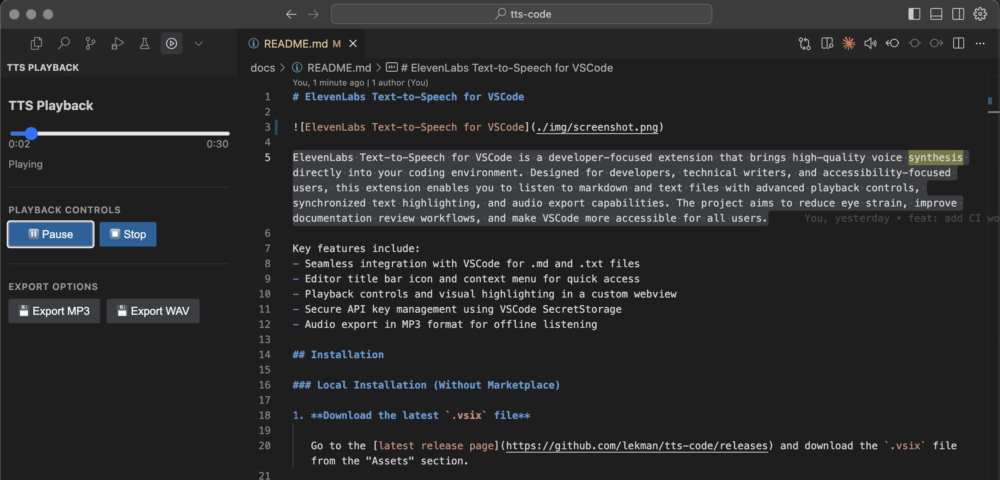

# ElevenLabs Text-to-Speech for VSCode

ElevenLabs Text-to-Speech for VSCode is a developer-focused extension that brings high-quality voice synthesis directly into your coding environment. Designed for developers, technical writers, and accessibility-focused users, this extension enables you to listen to markdown and text files with advanced playback controls, synchronized text highlighting, and audio export capabilities. The project aims to reduce eye strain, improve documentation review workflows, and make VSCode more accessible for all users.

Key features include:
- Seamless integration with VSCode for .md and .txt files
- Editor title bar icon and context menu for quick access
- Playback controls and visual highlighting in a custom webview
- Secure API key management using VSCode SecretStorage
- Audio export in MP3 format for offline listening

## Installation

### Local Installation (Without Marketplace)

1. **Download the latest `.vsix` file**

   Go to the [latest release page](https://github.com/lekman/tts-code/releases) and download the `.vsix` file from the "Assets" section.

2. **Install in VS Code or Cursor**

   - Open VS Code or Cursor
   - Open the Command Palette (`Cmd+Shift+P` on macOS or `Ctrl+Shift+P` on Windows/Linux)
   - Type "Extensions: Install from VSIX..."
   - Select the `.vsix` file you downloaded

## Usage

Prerequisites:
- An ElevenLabs API key (get one at [elevenlabs.io](https://elevenlabs.io))

General Usage:

1. **Open a .md or .txt file**
2. **Click the extension icon in the editor title bar** or highlight text, right-click and select "TTS: Speak Text"
3. **Add your ElevenLabs API key** if prompted
4. **Use the text-to-speech user interface** when the conversion is complete to control playback

## Documentation

- For a detailed overview of the goals, features, technical requirements, and implementation plan, see the [Product Requirements Document (PRD)](./PRD.md).

- For detailed API and module documentation, see the [Code Documentation](./api/README.md).

- For our test strategy, CI checks, and manual acceptance test instructions, see the [Test Strategy](./TEST.md).

## Contributors

If you would like to contribute to this project, please see our [Contributing Guide](./CONTRIBUTING.md) for development setup and pull request instructions.
